.. image:: images/logo.png

===================================================
HitPay Payment Gateway for Odoo POS
===================================================

HitPay Payment Gateway for Odoo POS is an open source module that links Odoo based POS to HitPay Payment Gateway developed by https://www.hitpayapp.com/

Installation & Upgrade
======================

Download the latest module archive from https://github.com/hit-pay/odoo-extension/releases.

Now unzip the downloaded archive and copy the new pos_hitpay folder to Odoo addons directory. 

* [ODOO_ROOT_FOLDER]/server/odoo/addons/
* /var/lib/odoo/addons/[VERSION]/ (on Linux only)
* `addons_path` defined in odoo.conf

Then, you can choose  one of these instructions:

* In your Odoo administrator interface, browse to "Configuration" tab. Here in, activate the developer mode.
* Or restart Odoo server with *sudo systemctl restart odoo* on Linux or by restarting Windows Odoo service.
  Odoo will update the applications list on startup.
*  Then browse to "Applications" tab and click on "Update applications list".
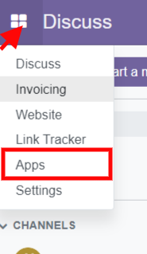

In your Odoo administrator interface, browse to "Applications" tab, delete "Applications" filter from
search field and search for "hitpay" keyword. Click "Activate" (or "Upgrade") button of the "HitPay Payment Gateway POS" module.

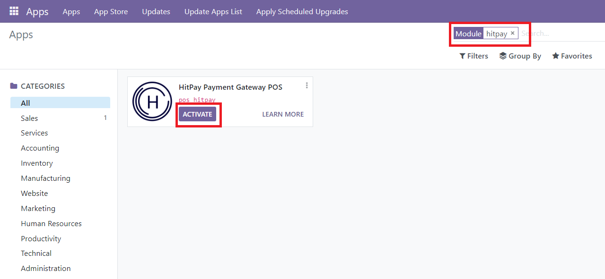

Configuration
=============

* Go to "Point of Sale Admin" tab
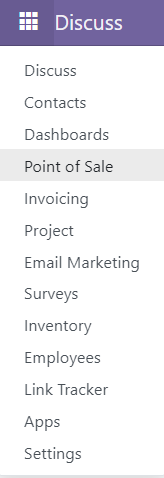
* In "Configuration" section, click "Payment Methods" menu
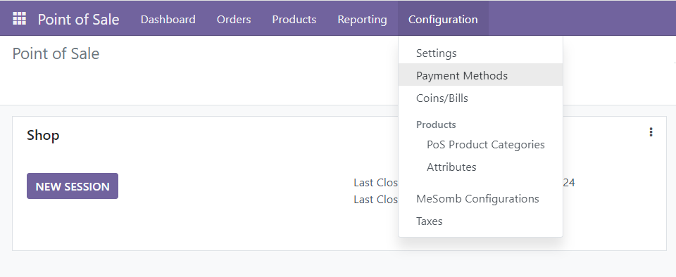
* Click New button to add the HitPay POS as the payment method
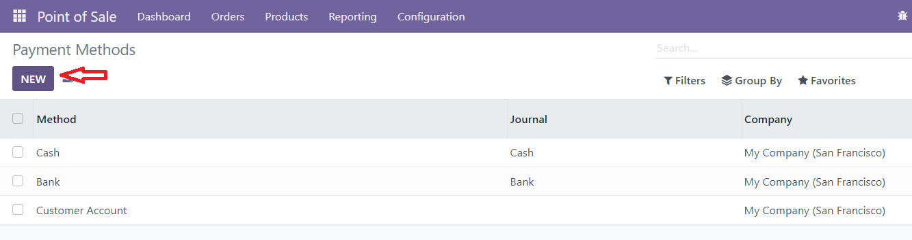
* Enter title for the Payment option, Payment Journal as Bank and must select the Use a Payment Terminal as 'HitPay Payment Gateway', once selected this terminal, enter the HitPay Payment Gateway credentials
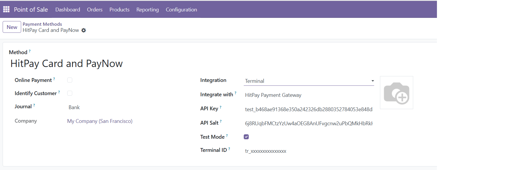
* And navigate to Settings page
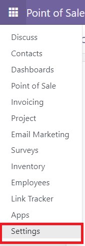
* And in the settings page, click the Point of Sale settings
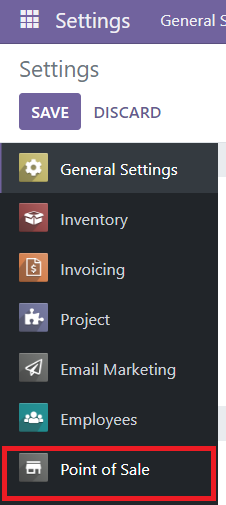
* And in the Point of Sale settings page, add 'HitPay Payment Gateway POS' as the available payment methods to POS Checkout
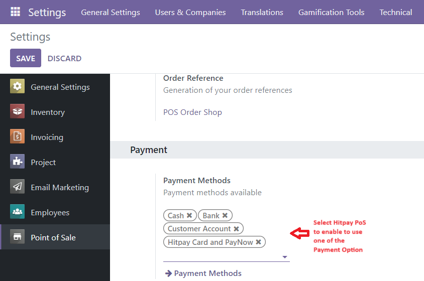

  
Checkout
=============
* Go to "Point of Sale Admin" tab and click New Session

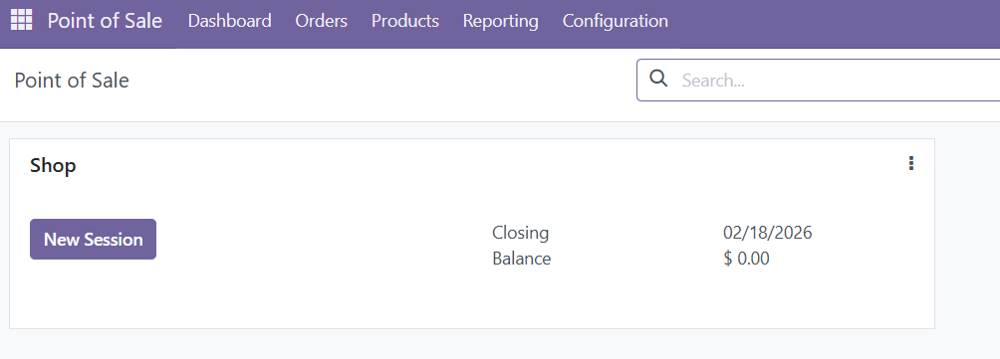
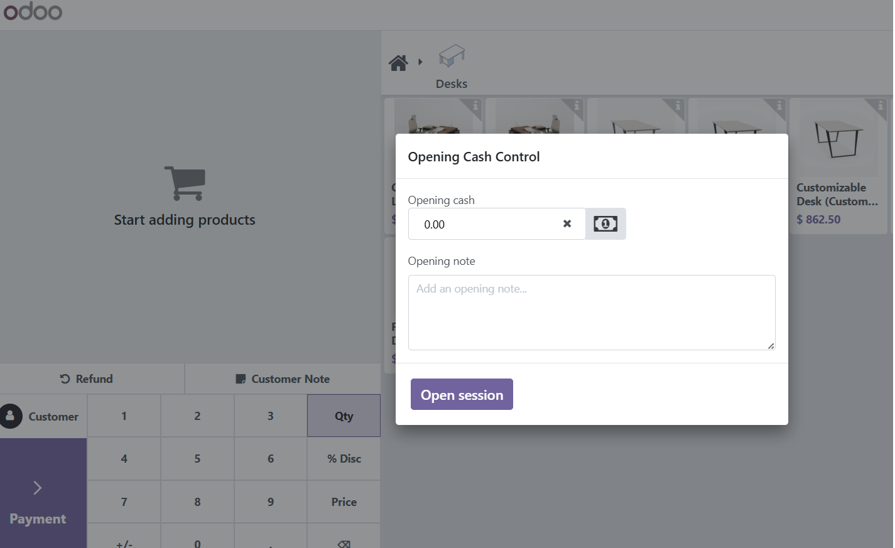
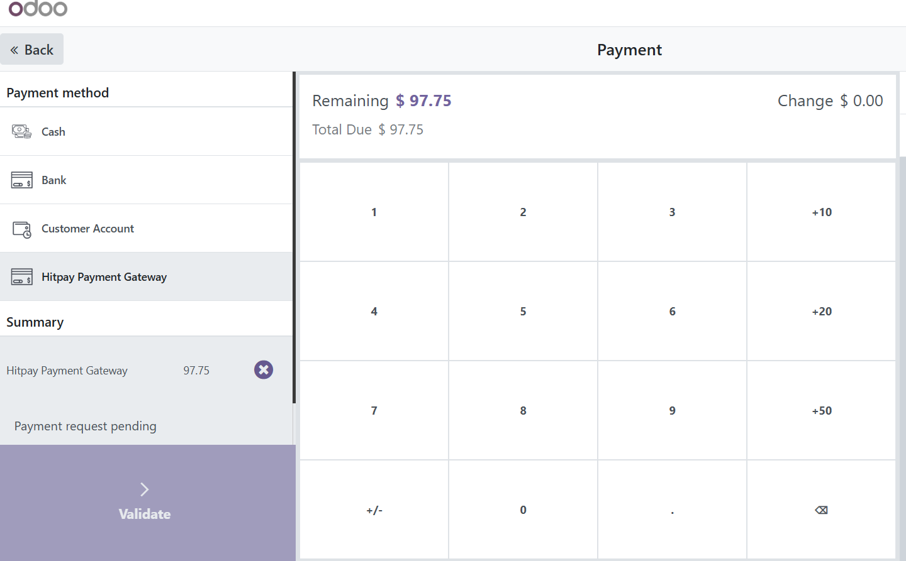
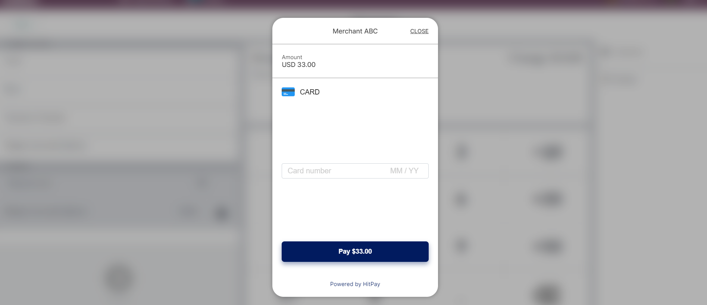

Payment Confirmation
--------------------
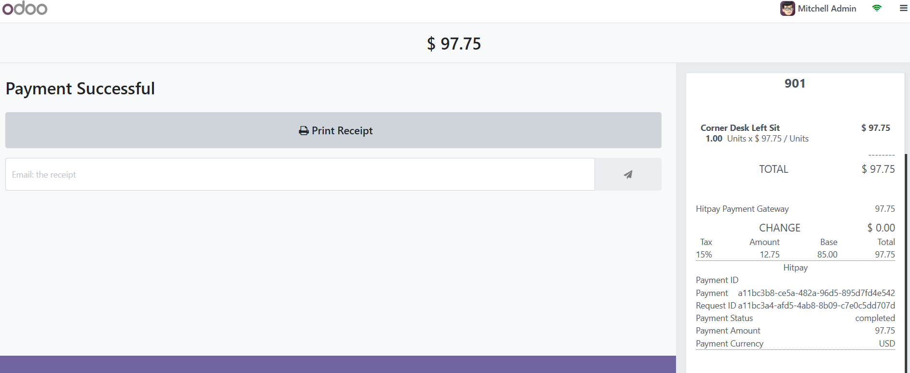

POs Order
===========
Navigate to POS Orders => Orders

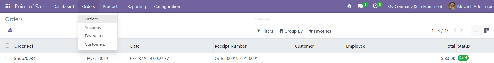

Payment Transaction Details
===========================
Click to view an order and go Payment tab and click the payment link

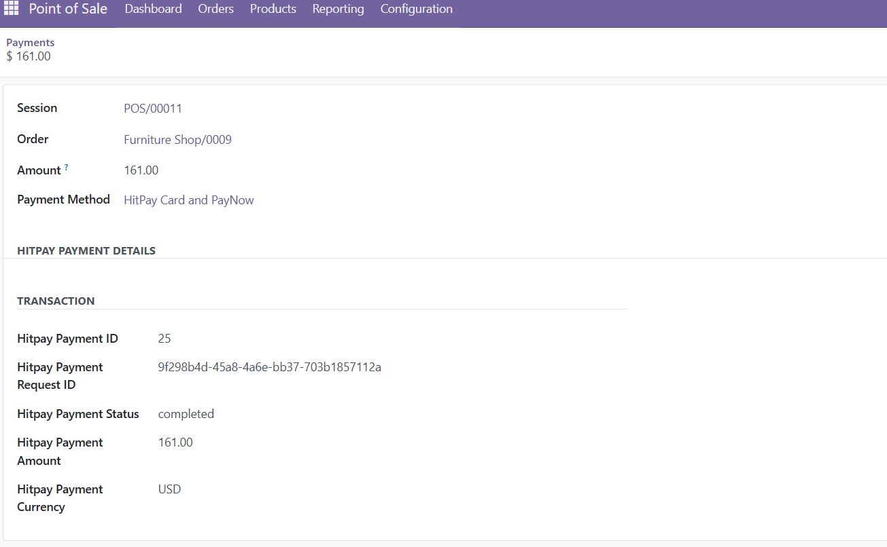

Refunds
===========================
* In the order view page, click the Return Products button and then click the Payment Button and in the Popup, make sure you select the Hitpay Payment Gateway POS as refund Payment method.
* You see the below screen and click the 'Make Payment' button and enter the amount to refund. (Amount should be in the negative)
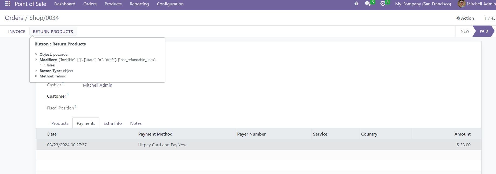
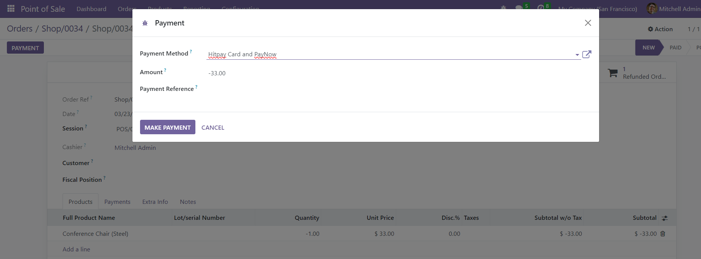
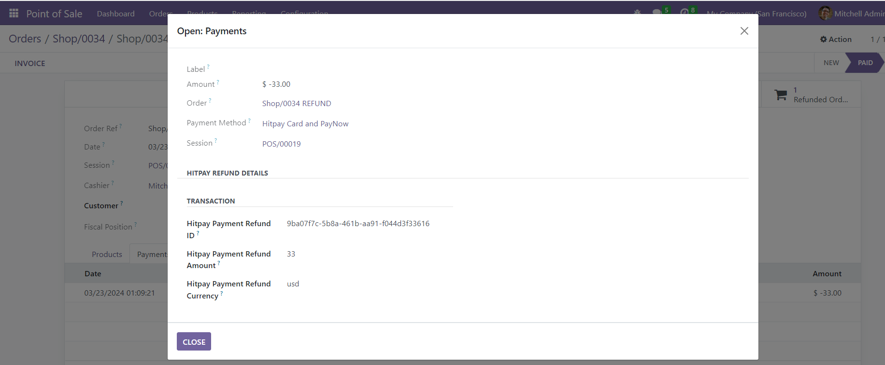

Change Log
==========
1.0.0.
--------------------
* Initial release.
